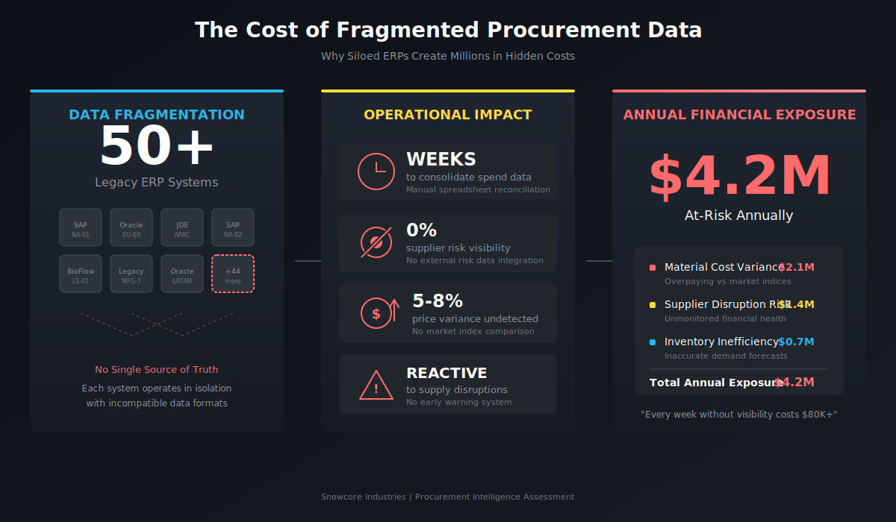
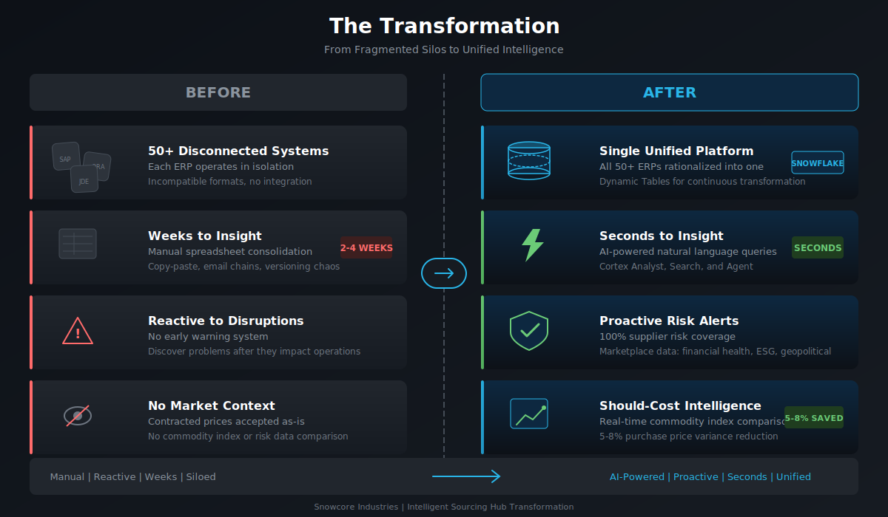
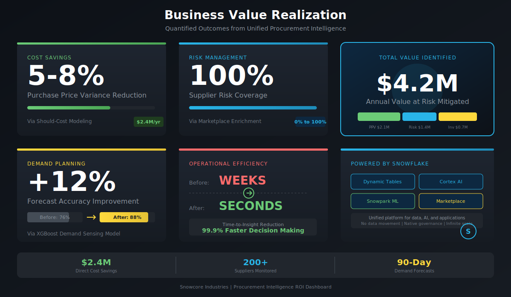
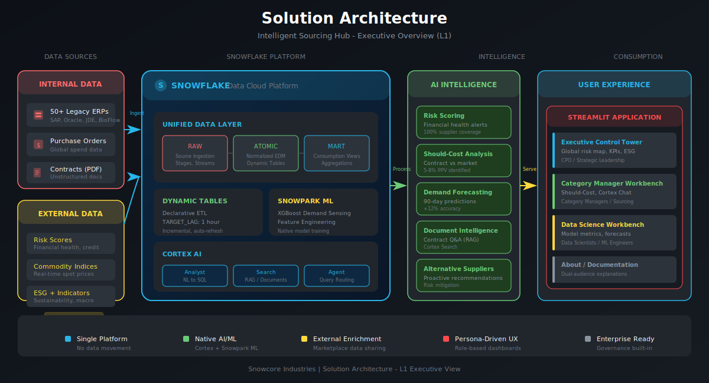
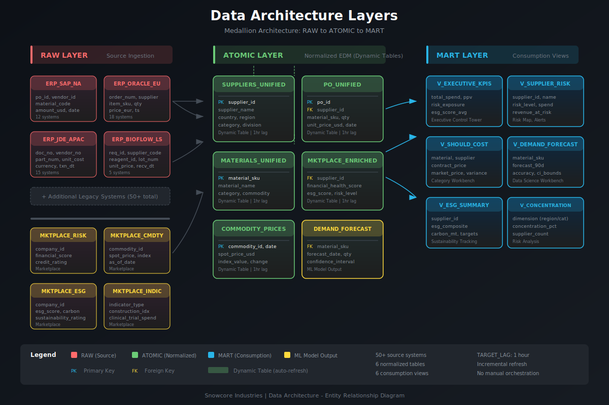

# Snowcore Industries Intelligent Sourcing Hub

## Solution Presentation Overview

---

## 1. The Cost of Inaction

### A Wake-Up Call from the Supply Chain

In March 2021, a single semiconductor factory fire in Japan triggered $170 million in production losses for automotive manufacturers within 72 hours. Companies that had "diversified" their supplier base discovered too late that their tier-2 and tier-3 suppliers shared common dependencies. The same pattern repeated during the 2022 Shanghai lockdowns and the 2023 Red Sea shipping disruptions.

**The uncomfortable truth:** Most manufacturers cannot answer basic questions about their supply chain exposure until a crisis forces the answer.

### Snowcore Industries: A Case Study in Complexity

Snowcore Industries exemplifies the challenge facing modern manufacturers:

| Dimension | Current State |
|-----------|---------------|
| **ERP Systems** | 50+ legacy systems (SAP, Oracle, JDE, BioFlow) |
| **Supplier Base** | 200+ global suppliers across 40 countries |
| **Divisions** | Industrial Compression + BioFlow (Life Sciences) |
| **Data Formats** | Incompatible schemas, currencies, identifiers |

**Result:** No single source of truth. Critical procurement decisions made with incomplete data.

### The Hidden Cost of Fragmentation

| Impact Area | Annual Exposure |
|-------------|-----------------|
| Material cost variance (overpaying vs. market) | $2.1M |
| Supplier disruption risk (unmonitored) | $1.4M |
| Inventory inefficiency (poor forecasts) | $0.7M |
| **Total Annual Exposure** | **$4.2M** |

Every week without visibility costs $80,000+ in unidentified savings and unmitigated risk.

---

## 2. The Problem in Context

### Who Feels the Pain?

**Chief Procurement Officer (Strategic)**
> "I need a consolidated view of global spend across all 50+ ERPs, normalized to verify we are meeting our ESG sustainability targets. Instead, I get Excel files from 12 different analysts that don't reconcile."

**Category Manager - Metals (Operational)**
> "I want to compare our contracted alloy rates against real-time global spot indices to identify specific invoices where we overpaid. Currently, this takes my team 3 weeks of manual spreadsheet work."

**Supply Chain Data Scientist (Technical)**
> "I want to train a demand sensing model using internal consumption history and external macro-economic indicators. But I spend 80% of my time cleaning and joining data from different sources."

### Five Critical Pain Points

1. **Weeks to Insight**
   - Manual spreadsheet consolidation across 50+ systems
   - Copy-paste, email chains, version control chaos
   - By the time analysis is complete, the data is stale

2. **Zero Supplier Risk Visibility**
   - No integration with external financial health data
   - Supplier problems discovered after they impact operations
   - No proactive early warning system

3. **5-8% Price Variance Undetected**
   - Contracted prices accepted without market context
   - No comparison against commodity indices
   - Negotiation leverage lost

4. **Reactive Disruption Response**
   - Supply chain problems discovered after the fact
   - No automated alerts on supplier financial distress
   - No pre-identified alternative suppliers

5. **Siloed Tribal Knowledge**
   - Contract terms buried in PDF documents
   - Compliance history scattered across email threads
   - No searchable repository for institutional knowledge

---

## 3. The Transformation

### From Fragmented to Unified

| Before | After |
|--------|-------|
| 50+ disconnected ERP systems | Single unified data platform |
| Weeks to consolidate spend data | Seconds to insight via natural language |
| Zero supplier risk coverage | 100% coverage via Marketplace enrichment |
| Reactive to disruptions | Proactive alerts with alternative recommendations |
| Manual spreadsheet analysis | AI-powered Should-Cost modeling |
| Tribal knowledge in PDFs | Searchable document intelligence (RAG) |

### The Three-Pillar Approach

**1. UNIFY**
Rationalize 50+ legacy ERPs into a single source of truth using Snowflake Dynamic Tables. Continuous transformation with declarative SQL, no orchestration code required.

**2. ENRICH**
Augment internal data with Snowflake Marketplace intelligence:
- Financial health and credit risk scores
- Real-time commodity price indices
- ESG sustainability ratings
- Macro-economic indicators

**3. PREDICT**
Apply AI/ML to drive proactive decision-making:
- XGBoost demand sensing model (Snowpark ML)
- Cortex Analyst for natural language analytics
- Cortex Search for document Q&A (RAG)
- Cortex Agent for compound query routing

---

## 4. What We'll Achieve

### Quantified Business Outcomes

| KPI | Target | Mechanism |
|-----|--------|-----------|
| **Purchase Price Variance** | 5-8% reduction | Should-Cost modeling against market indices |
| **Supplier Risk Coverage** | 0% to 100% | Marketplace financial health enrichment |
| **Forecast Accuracy** | +12% improvement | XGBoost demand sensing with external features |
| **Time-to-Insight** | Weeks to Seconds | Cortex AI natural language queries |

### Total Value Identified: $4.2M Annually

**Direct Savings**
- $2.4M from identified price variance (Should-Cost analysis)
- Negotiation playbooks generated automatically

**Risk Mitigation**
- 200+ suppliers monitored continuously
- Proactive alerts before disruption

**Operational Efficiency**
- 90-day demand forecasts with confidence intervals
- Inventory optimization recommendations

---

## 5. Why Snowflake

### Four Pillars Mapped to the Solution

| Pillar | Solution Benefit |
|--------|------------------|
| **Unified Data** | Single platform for all 50+ ERPs, Marketplace data, and documents. No data movement, no integration middleware. Dynamic Tables handle continuous transformation declaratively. |
| **Native AI/ML** | Cortex Analyst, Search, and Agent built in. Snowpark ML for XGBoost training without data export. LLM capabilities without managing infrastructure. |
| **Collaboration** | Snowflake Marketplace provides live risk, commodity, and ESG data without copying. Data sharing enables supplier collaboration. |
| **Governance** | Row-level security by division (Industrial vs. BioFlow). Column masking for PII. Full audit trail and lineage. |

### Technical Differentiators

**No Data Movement**
Internal ERP data, external Marketplace data, and ML models all operate within Snowflake. Zero ETL latency for enrichment.

**Declarative ETL**
Dynamic Tables replace complex orchestration. Define the transformation once; Snowflake handles incremental refresh automatically.

**Integrated AI Stack**
Cortex services (Analyst, Search, Agent) are native. No separate deployment, no API management, no token budgeting.

---

## 6. How It Comes Together

### Solution Architecture

### Step-by-Step Walkthrough

**Step 1: Data Ingestion**
- ERP dumps land in external stages (S3)
- Snowpipe auto-ingests with < 1 minute latency
- Streams track changes for downstream processing

**Step 2: Continuous Transformation**
- Dynamic Tables normalize and unify data
- TARGET_LAG = 1 hour for near real-time freshness
- Supplier matching, currency conversion, risk scoring

**Step 3: Marketplace Enrichment**
- Live data sharing from risk, commodity, ESG providers
- No data copy required, always current
- Joined to internal data in the ATOMIC layer

**Step 4: AI/ML Processing**
- XGBoost demand sensing model trained in Snowpark ML
- Cortex Search indexes supplier contracts for RAG
- Cortex Analyst semantic model enables natural language

**Step 5: Insights Delivery**
- MART views optimized for each persona
- Streamlit application with role-based access
- Cortex Agent routes queries to appropriate service

### Data Architecture

### The "Wow" Moment

Ask the Cortex Agent:

> "Identify suppliers for BioFlow precision components with high financial risk scores"

The system instantly:
1. Returns a list of at-risk suppliers (Cortex Analyst)
2. Calculates the revenue at risk
3. Retrieves contract termination clauses (Cortex Search)
4. Recommends validated alternative suppliers from Marketplace data

**Result:** Proactive intervention before disruption occurs. Time-to-insight: seconds, not weeks.

---

## Technical Deep-Dive

For detailed implementation patterns, see:
- [Architecture Documentation](ProcurementIntelligence_Architecture.md)
- [L2 Technical Architecture](images/architecture-detailed.svg)

---

*Snowcore Industries Intelligent Sourcing Hub*
*Powered by Snowflake Cortex*
